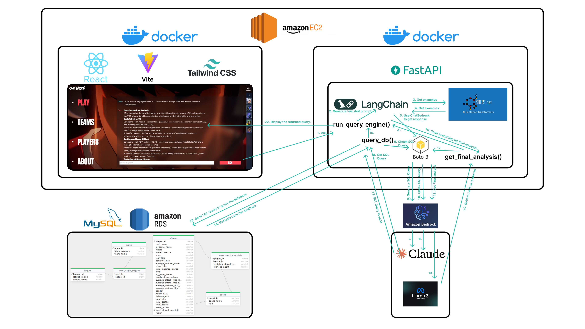

# One More - the VALORANT Esports Digital Assistant

The image below shows the workflow of the application.

## Frontend

- ReactJS
- Tailwind CSS
- Axios

## Backend

- FastAPI
- AWS Bedrock
- Langchain
- HuggingFace
- AWS RDS MySQL database (Free Tier)

## LLM Models used

- Claude 3.5 Sonnet v2
- Meta Llama 3.1 Instruct 70B

## Deployment

- AWS EC2 instance (Free Tier)
- Docker

## Cost
This is one of the cheapest ways in my opinion to achieve our goals!

# Project Story

## Inspiration
When I heard VALORANT is conducting a hackathon, it immediately inspired me to build this. Being attached to this game, forming friendships off it, VALORANT is a big part of my life. It is around Champions 2023 that I started my development career. The song Ticking Away keeps waking me up every day to be better!

## What it does
This assistant is able to filter players and teams, form teams from your prompts, give information about individual players, compare players, and much more! Utilising AWS Bedrock's Claude 3.5 Sonnet, Meta Llama 3.1 Instruct, AWS RDS MySQL Free Tier, AWS EC2 Free Tier, this assistant is very fast and smart.

## How I built it
- The pretty User Interface, my favorite part of this, is designed using ReactJS, Vite and TailwindCSS. It looks and feels exactly like VALORANT, giving a feeling at home. The background and the music is all from Patch 7.02, and inspires the user, giving a VALORANT like experience.
- The backend is a lightweight FastAPI application. The reason for going for the server option is due to Free Tier on EC2, allowing cost efficiency. Backend handles the manual LLM chain.
- The data is pre-processed to loop over all games and count player stats from each game. Hence, the ONLY datasource used is the public s3 bucket.
- The LLM workflow is pretty simple. First, the user's question is used to get some few-shot prompts, which have good SQL examples for the LLM to refer to. Then, again, the generated SQL query is sent to the LLM to verify any syntax errors and data manipulation motives. Finally, the SQL query fetches results from the database and these results are again fed into an LLM to elaborate.

## Reasons for data querying implementation
Both Amazon EC2 and Amazon RDS MySQL offer Free Tiers to accounts eligible. This was the cheapest way I could think of to implement this chatbot. Using EC2 Free Tier significantly reduced costs for Lambda, Agents, Secrets, and API Gateway, whereas using RDS MySQL Free Tier significantly reduced costs for Athena, Glue and/or OpenSearch service knowledge bases.

## Let's talk data
All games were looped through and stats were extracted from each game in the S3 bucket. The stats are mentioned in the picture below. Agent wise stats, KDA, attacking and defensive KDA, headshot percentage, aces, 4ks, pistol and operator kills, all have been accounted for. The reason for omitting win count and win rate is that these stats are dependent more on the team as a whole, not the player individually. Also, not mapping player kill locations was a decision taken by me, because all players should be able to kill in all areas of the map. Having a 'favourite' area doesn't make sense, especially because maps keep changing and new maps keep getting added. This was also a reason not to count map wins. Hopefully my reasoning makes sense! :D

## Challenges I ran into
- Initially the database was very complex, so it was a challenge for LLM models to generate SQL queries.
- Claude models were not accessible till the date of submission here in India, unless requested.
- us-west-2 region with the best models was giving an InvokeAccess error, so had to wait it out.
- The dataset was absolutely huge, over 700GB when extracted! I may or may not have deleted my favorite games to get space xD

## Accomplishments that I am proud of
Despite having minimal knowledge about LLMs at the start of this hackathon, I think I have come up with a pretty decent product. This is my first ever project utilising LLMs and I am glad it is on a game I love. I think it produces some very good results.

## What I learned
Firstly, I learnt that a developer will do a great job if they love the product they are building, if they see themselves connected to it. In a world of rapid code generation, we must strengthen our purpose as developers and find what we love, and create something beautiful. In terms of software engineering, I got to learn about FastAPI, a relatively new technology, I got to learn a lot, A LOT, about LLMs, Machine Learning, and how these things work. Surprise, it is all some really good maths, not magic!

## What's next for One More - the VALORANT Esports Digital Assistant
I want to add login, chat saving, and memory based responses in the future. I also want to test how I can improve its generation by giving more and more few shot prompts. I think this can really help someone pick the next Tenz!
